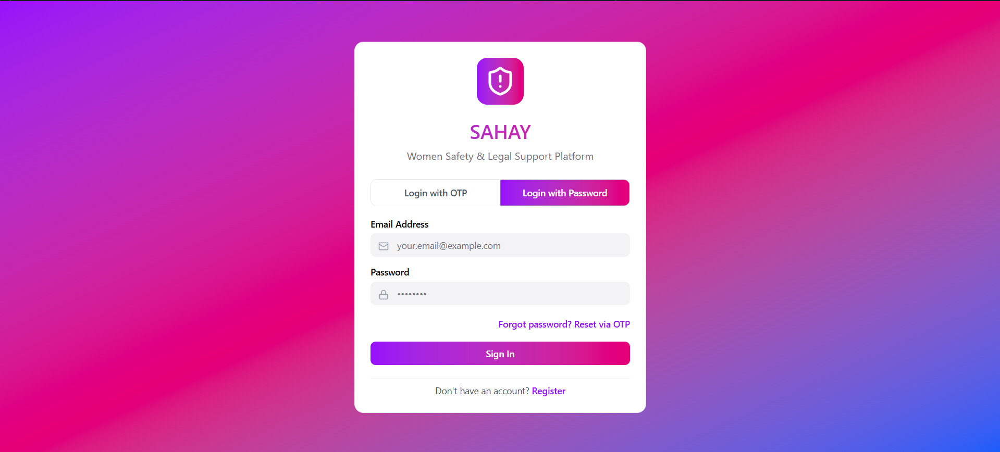
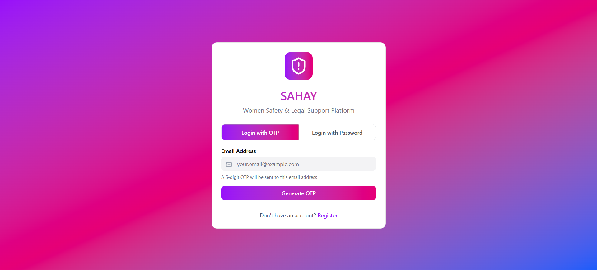
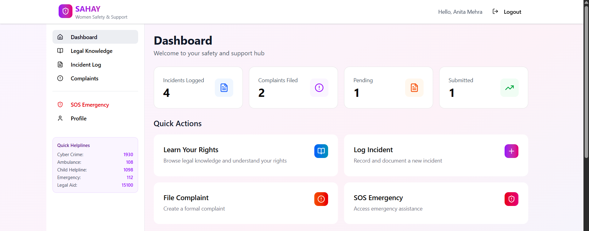
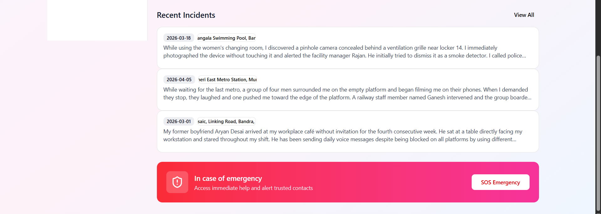
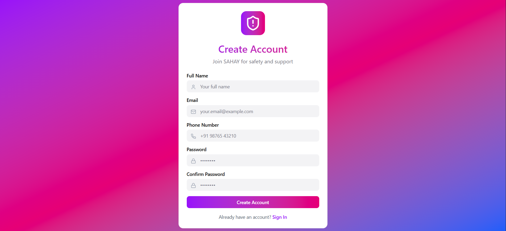
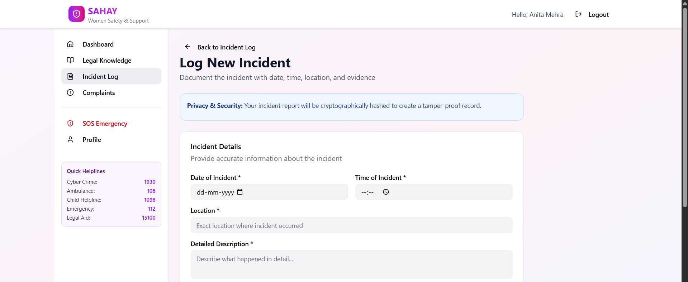
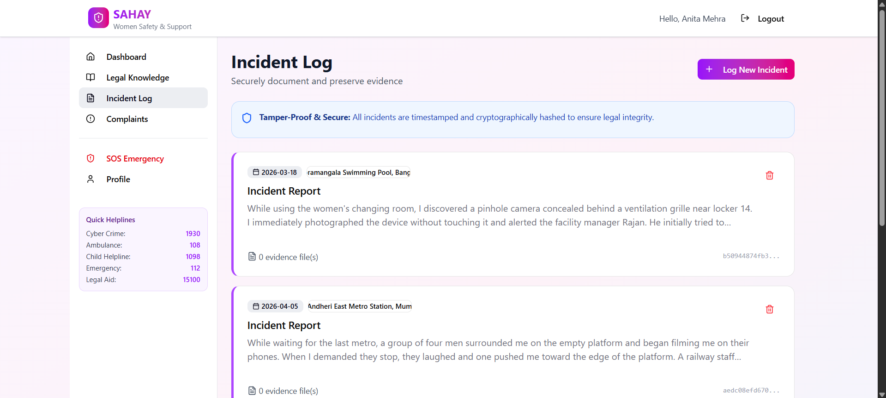
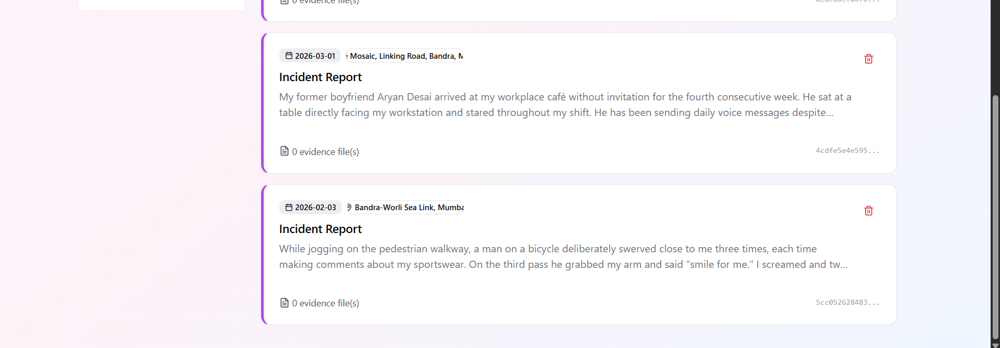
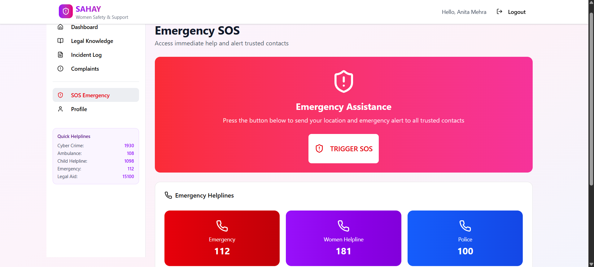
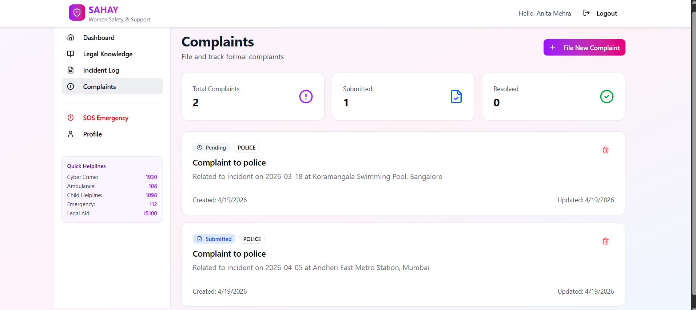

# 🌸 SAHAY – Women’s Safety & Legal Support Platform

> A full-stack, secure, and responsive platform designed to empower women with legal awareness, emergency support, and complaint management.

---

## ✨ Overview

SAHAY is a full-stack application designed to spread legal awareness and provide quick access to emergency help and complaint systems for women. 
It application that provides women with tools to stay safe, informed, and supported.
It integrates authentication, incident tracking, emergency SOS alerts, and legal complaint systems into one unified platform.

---

## 🚀 Key Features

### 🔐 Dual Authentication System

* Login using **Password (bcrypt)** OR **Email OTP**
* Secure **JWT-based authentication**
* Token-based protected routes

### 📝 Incident Logging (Tamper-Proof)

* Records incidents with **SHA-256 hashing**
* Blockchain-style integrity (linked records)
* Upload evidence files securely

### ⚖️ Complaint Management System

* File complaints to:

  * Police
  * ICC
  * NGOs
  * Legal Aid
* Track complaint status
* Export complaints as **PDF**

### 🚨 SOS Emergency System

* One-click emergency alert
* Sends SMS alerts to contacts *(Twilio-ready)*
* Stores SOS history

### 📱 Fully Responsive UI

* Mobile-first design
* Adaptive layouts (mobile / tablet / desktop)
* Clean UI using Tailwind + modern components

---

## 🧠 System Architecture

Client → API → Services → Database

* **Frontend:** React + Vite + TypeScript
* **Backend:** Node.js + Express.js
* **Auth Layer:** JWT Middleware + OTP verification
* **Database:** MongoDB Atlas (6 collections)
* **External Services:** Nodemailer (OTP), Twilio (SOS)

---

## 🛠️ Tech Stack

### 💻 Frontend

* React 18
* Vite
* TypeScript
* Tailwind CSS
* React Router
* shadcn/ui + Radix

### ⚙️ Backend

* Node.js
* Express.js
* JWT (jsonwebtoken)
* bcryptjs
* Multer (file uploads)
* Nodemailer (OTP emails)

### 🗄️ Database & Tools

* MongoDB Atlas
* Mongoose
* jsPDF (PDF export)
* Nodemon

---

## 📁 Project Structure

```
SAHAY/
│── src/                # Frontend
│── public/
│── sahay-backend/      # Backend API
│── assets/             # Screenshots
│── README.md
```
## 🖼️ Screenshots

### 🔐 Login Page — Dual Authentication Interface

**Password Login**


**OTP Login**


---

### 📊 Dashboard




---

### 📝 User Registration Form



---

### 🧾 Incident Logging

**Form View**



**List View**



---

### 🚨 SOS Emergency Page



---

### ⚖️ Complaint Detail View



---

### 📚 Legal Knowledge Section

.png)
.png)
.png)
.png)
.png)

---

## ⚙️ Installation & Setup

### 1️⃣ Clone repository

```
git clone https://github.com/khushii-patil/SAHAY.git
```

### 2️⃣ Install frontend dependencies

```
npm install
```

### 3️⃣ Run frontend

```
npm run dev
```

### 4️⃣ Run backend

```
cd sahay-backend
npm install
npm start
```

---

## 🔐 Environment Variables

Create `.env` in backend:

```
PORT=5000
MONGO_URI=your_mongodb_connection
JWT_SECRET=your_secret_key
EMAIL_USER=your_email
EMAIL_PASS=your_password
```

---

## 🌟 Future Enhancements

* 📍 Real-time GPS tracking for SOS
* 🤖 AI-based legal assistant
* 📱 Mobile app version
* 🔔 Push notifications

---

